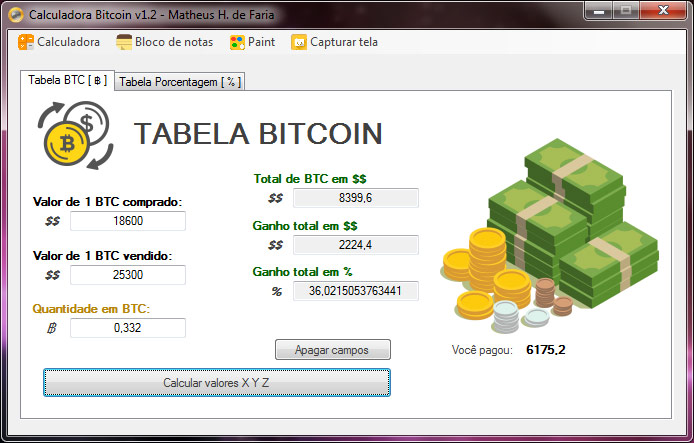
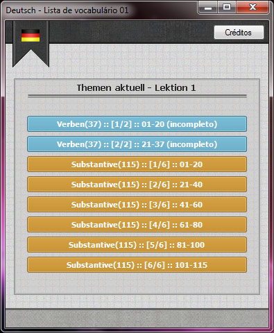
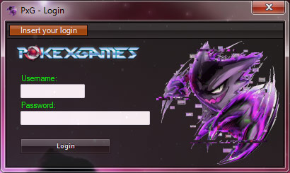
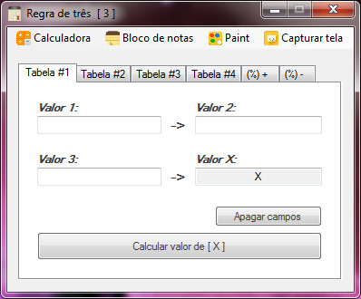
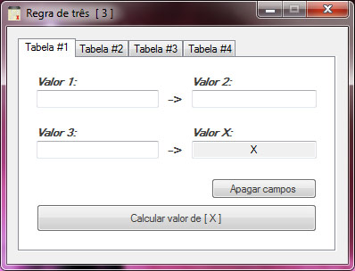

# VB.NET Programs
## All of them were created by Matheus Henrique de Faria. They are open souce, feel free to download them.

### Previews

**Calculadora Bitcoin simples v1.2** - VB.NET

**Deutsch** - VB.NET

**Pokexgames** - VB.NET

**Regra de 3 melhorada** - VB.NET

**Regra de 3 simples** - VB.NET

## License
